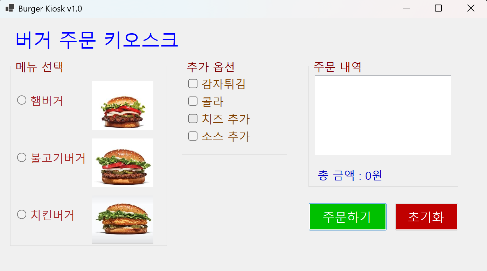
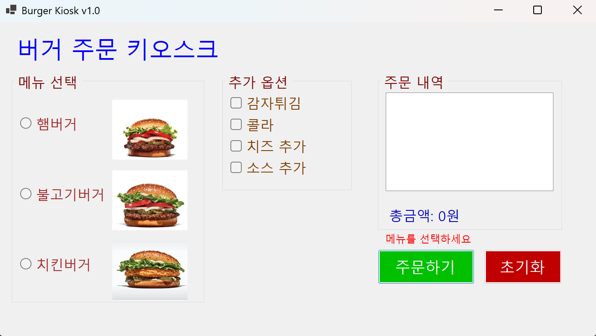
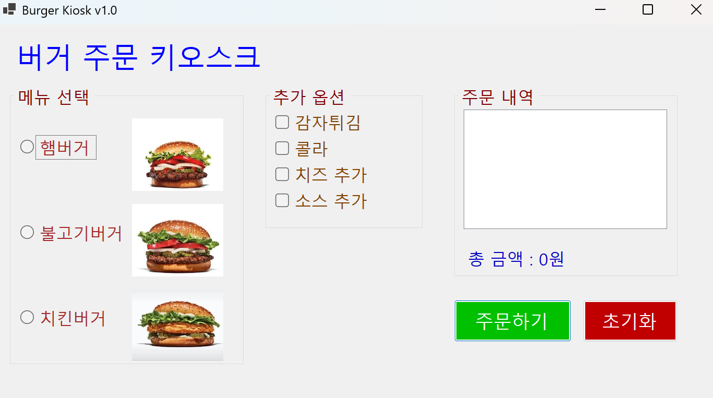
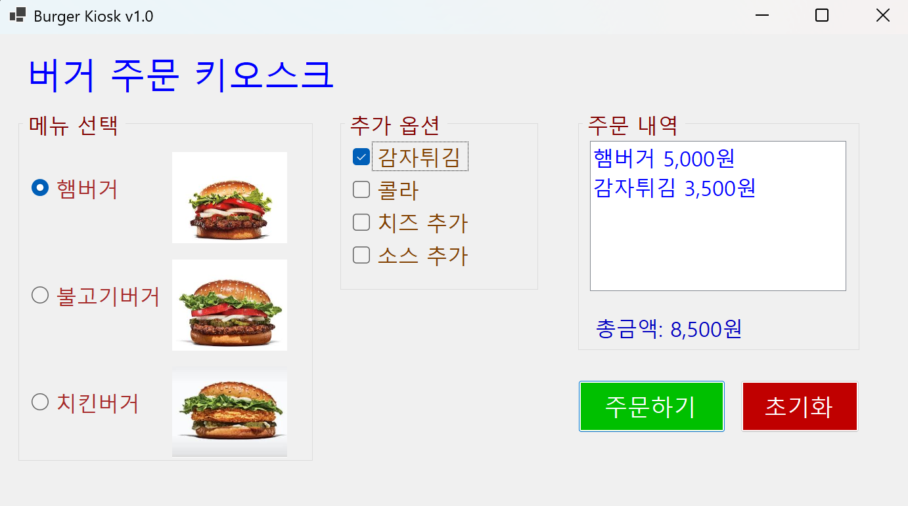

# (C# 코딩) BurgerKiosk

## 개요
- C# 프로그래밍 학습

- 1줄 소개 : 사용자의 선택 기반 입력을 받아서 키오스크 기능을 구현한 프로그램

- 사용한 플랫폼 :
  - ```C#```, ```.NET Windows Forms```, ```Visual Studio 2026```, ```GitHub``` 
  
- 사용한 컨트롤 :  
    - ```Label,GroupBox, PictureBox, ListBox, RadioButton, CheckBox,Button```
    
- 사용한 기술과 구현한 기능 :
  - **Windows Forms 앱 (C#)**: `Visual Studio`의 디자이너를 활용하여 직관적인 키오스크 UI(RadioButton, CheckBox) 
  - **TabIndex 및 TabStop 속성 활용**: `Tab` 키로 입력 필드 간 이동 및 포커스 설정
  - **AcceptButton 속성 활용** :  `Enter` 키로 로그인 시도 가능하도록 설정하여 키보드 접근성 향상
 
 
- 화면 구성 : 
  
  

## 실행 화면 (과제1)

- 과제1 코드의 실행 스크린샷


  - 과제 내용
    - 컨트롤 배치와 기본적인 속성 설정 
    - 선택된 항목 추출 기능 구현
      
  - 구현 내용과 기능 설명
    - **UI 구성** : ```RadioButton```과 ```CheckBox```등을 적절히 배치
    - **GroupBox 묶기** : ```GroupBox```로 적절하게 그룹으로 묶기
    - **주문하기 및 초기화 버튼** : 주문내역과 총 금액 표시, 다시 주문할 수 있도록 초기화
    
  - 사용한 기술과 구현한 기능
    - ```RadioButton과 CheckBox, GroupBox```등의 컨트롤을 활용한 UI 구성
    - ```radioButton.Checked```, ```checkBox.Checked```속성을 활용해 ```RadioButton```과 ```CheckBox```의 선택 여부를 검사하여 개별 가격 연산 및 초기화
    - ```listBox.Item.Add()```를 활용하여 선택된 값을 ```ListBox```에 추가
    

## 실행 화면 (과제2)

- 과제2 코드의 실행 스크린샷

 

- 과제 내용
    - 아무것도 선택하지 않고 주문하기 버튼을 누르면 에러 메시지 표시
      
- 구현 내용과 기능 설명
    - **에러 메시지 표시** : 아무것도 선택하지 않고 주문하기 버튼을 누르면 에러 메시지 표시 전환 
   
- 사용한 기술과 구현한 기능
    - ```Label``` 컨트롤 추가
    - ```Visible``` 속성을 활용하여 메시지 보이기와 숨기기 기능 구현
  
## 실행 화면 (과제3)

- 과제3 코드의 실행 스크린샷
 

 - 과제 내용
    - 마우스 없이 키보드 입력만으로 주문이 가능하게 만들기
 
 - 구현 내용과 기능 설명
    - **Tab 입력 처리** : ```Tab```을 이용해서 ```GroupBox```사이를 이동
    - **방향키 입력 처리** : ```방향키```를 이용해서 선택 아이템 사이 이동
    - **Space 입력 처리** : ```Space```를 이용해서 아이템 선택
    - **Enter 입력 처리** : ```Enter```를 이용해서 주문하기 버튼 클릭

- 사용한 기술과 구현한 기능
    - ```TabIndex```와 ```TabStop``` 속성을 활용하여 탭 순서 설정 및 포커스 설정
    - ```AcceptButton``` 속성을 활용하여 ```Enter```키로 주문하기 버튼 클릭 

## 실행 화면 (과제4)

 - 과제4 코드의 실행 스크린샷

    

- 과제 내용
    - ```RadioButton```과 ```CheckBox```에서 원하는 항목을 선택하면 그 즉시 정보 업데이트

- 구현 내용과 기능 설명
    - **실시간 정보 업데이트** :  선택이 변경될 때마다 주문 내역과 총 금액이 즉시 업데이트되도록 구현    

- 사용한 기술과 구현한 기능
    - ```CheckedChanged``` 이벤트 핸들러를 활용하여 ```RadioButton```과 ```CheckBox```의 선택이 변경될 때마다 주문 내역과 총 금액 업데이트 구현 
    - ```listBox.Items.Remove()```를 활용하여 선택이 해제된 아이템을 ```ListBox```에서 제거